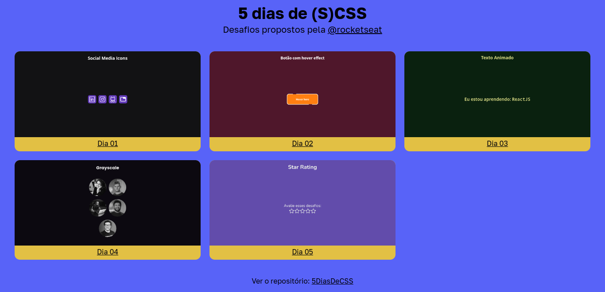

<h1 align="center"> 5DiasDeCSS </h1>

  Projeto desenvolvido para fortalecer meus conhecimentos em CSS, no caso SCSS (SASS), desafios proposto pela <a href="https://www.rocketseat.com.br/">Rocketseat</a>.

  <a href="#-tecnologias">Tecnologias</a>&nbsp;&nbsp;&nbsp;|&nbsp;&nbsp;&nbsp;
  <a href="#-projeto">Projeto</a>&nbsp;&nbsp;&nbsp;|&nbsp;&nbsp;&nbsp;
  <a href="#-desafios">Desafios</a>&nbsp;&nbsp;&nbsp;|&nbsp;&nbsp;&nbsp;
  <a href="#memo-licença">Licença</a>

  

 

  

## 🚀 Tecnologias

Esse projeto foi desenvolvido com as seguintes tecnologias:

- [SASS](https://sass-lang.com/)
- [VanillaJS](http://vanilla-js.com/) 😆️
- [Node e NPM](https://nodejs.org/)
- [Vite](https://vitejs.dev/)

## 💻 Projeto

O 5DiasDe(S)CSS é um projeto de desafios para documentar e aprender sobre a tecnologia SASS, o CSS com super poderes, que possibilita várias funcionalidades como aninhar as declarações, criar variáveis de forma fácil (parecido com JS) e é muito gostosinho de usar!

[Veja os projetos aqui ←](https://fivedaysofcss-poveii.netlify.app/)

## 🧾️ Desafios

Os desafios utilizados para criar esses mini projetos foram disponibilizados no Instagram da Rocketseat - [@rocketseat](https://www.instagram.com/rocketseat/) - através de posts na última semana do mês de dezembro de 2022.

## :memo: Licença

Esse projeto está sob a licença MIT.

---

Feito assim 😎️ by Poveii
